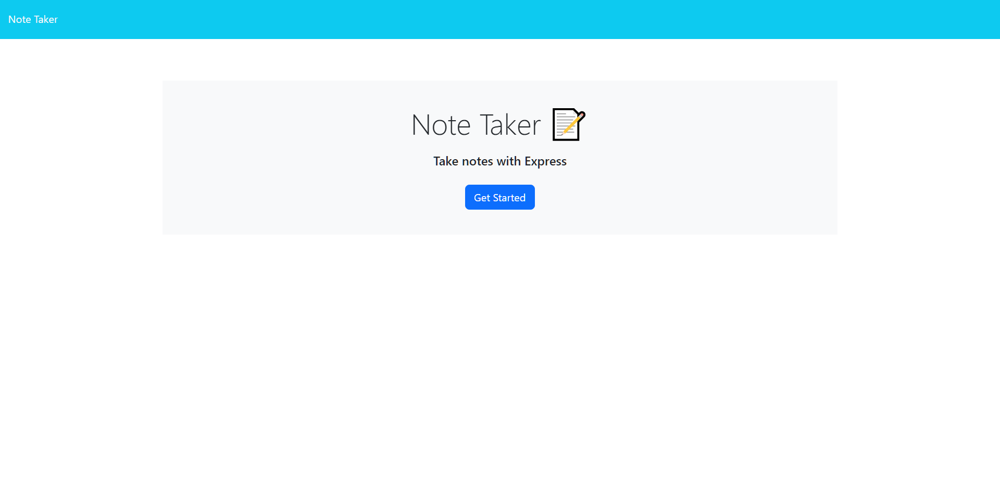
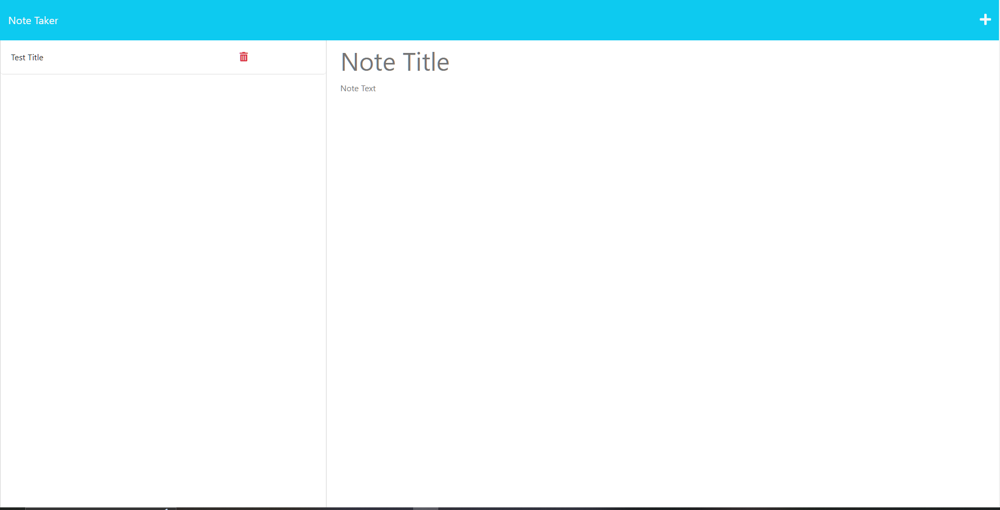

# Note Taker

## Licence

## Table of Contents

- [Description](#Description)
- [Links](#Links) 
- [Installation](#Installation)
- [Usage](#Usage)
- [Testing](#Testing)
- [Credits](#Credits)
- [Questions](#Questions)

## Description

As a small business owner I want to be able to write and save notes so that I can organize my thoughts and keep track of tasks I need to complete.this challenge is to create an application called Note Taker that can be used to write and save notes. This application will use an Express.js back end and will save and retrieve note data from a JSON file.

## Links

   
 

## Installation

1. To install application, clone using "git clone" command via the HTTP or SSH link on github.
2. Use the recommended file structure to organize the files.
3. Installing npm using "npm init" in the terminal.
4. Run "npm install" and then install Express.js
5. Then deploy the entire application to Heroku.
6. Fullfill the challenge requirements and submit to heroku.

## Usage

The challenge use the application should have a db.json file on the back end that will be used to store and retrieve notes using the fs module.

## Testing

This application contains test driven development using the 

## Credits 

## Questions

GitHub Username: BrownCAB
 E-mail: brown.calah@hotmail.com 
 Contact: E-mail